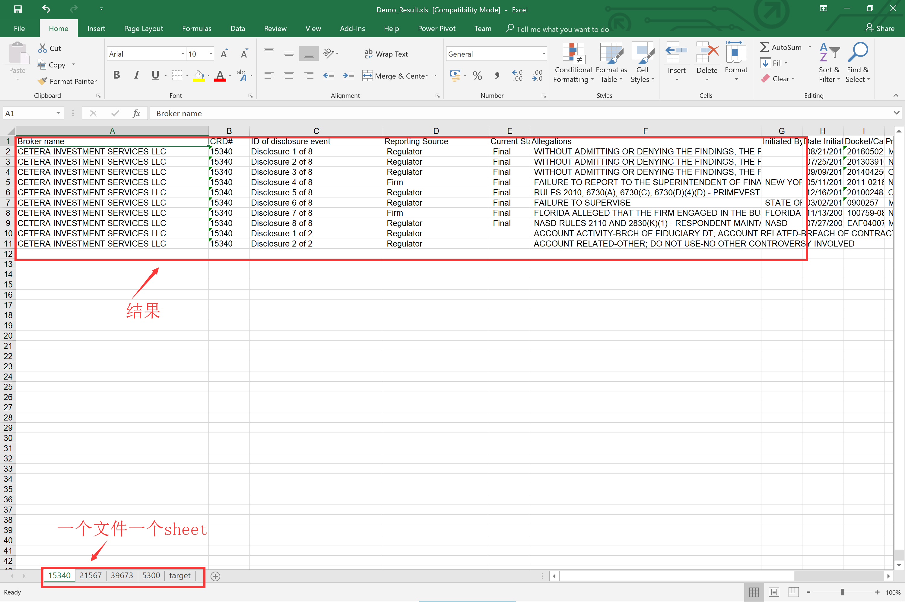
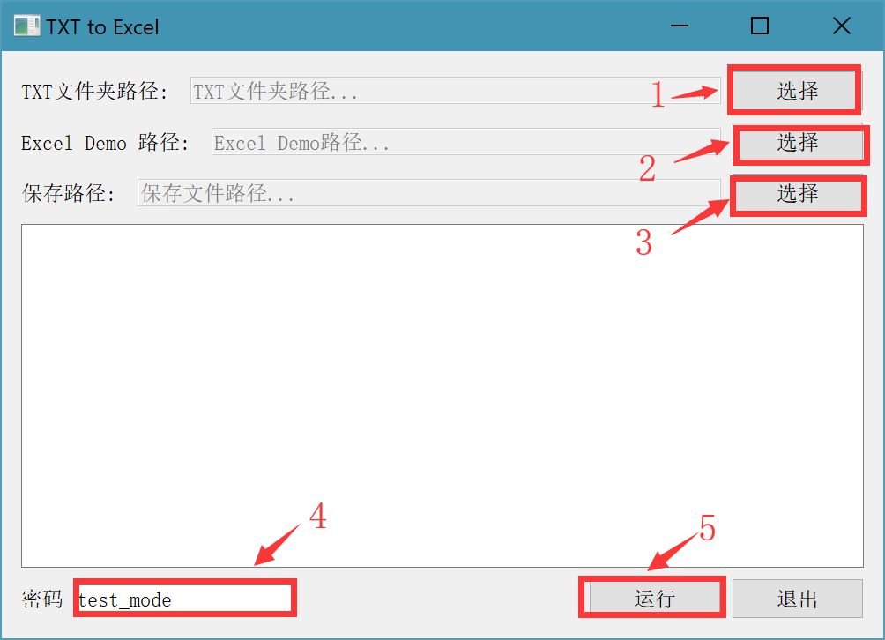

- - PDF2Excel.exe程序使用说明

    ------

    - 功能介绍：程序从txt文件中读取内容然后抽取指定内容，要抽取的关键词需要写入Excel中，一个PDF样本如下示例：

      

      保存到Excel的样本如下图示意：

      

      最终提取的结果如下示意：

      

    - 用法：

      - 首先将PDF转换为TXT文件，转换方法如下：

        - 使用迅捷转换器转换

          

        - 将所有需要转换的TXT文件放在一个文件夹内

      - 双击运行`PDF2Excel.exe` ，弹出如下界面：

        

        - 依次选择TXT文件夹路径，Excel路径，保存路径
        - 运行程序得到结果

    - 获取帮助：

      - 作者：yooongchun
      - Email：yooongchun@foxmail.com
      - 微信公众号：yooongchun小屋
      - 网站：www.yooongchun.com
      - CSDN博客：https://blog.csdn.net/zyc121561